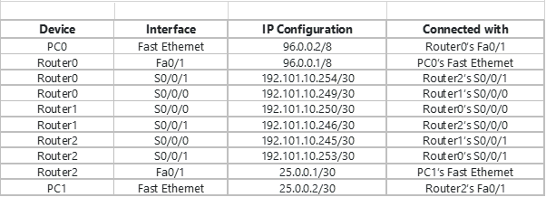
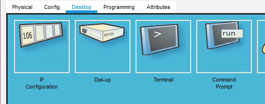
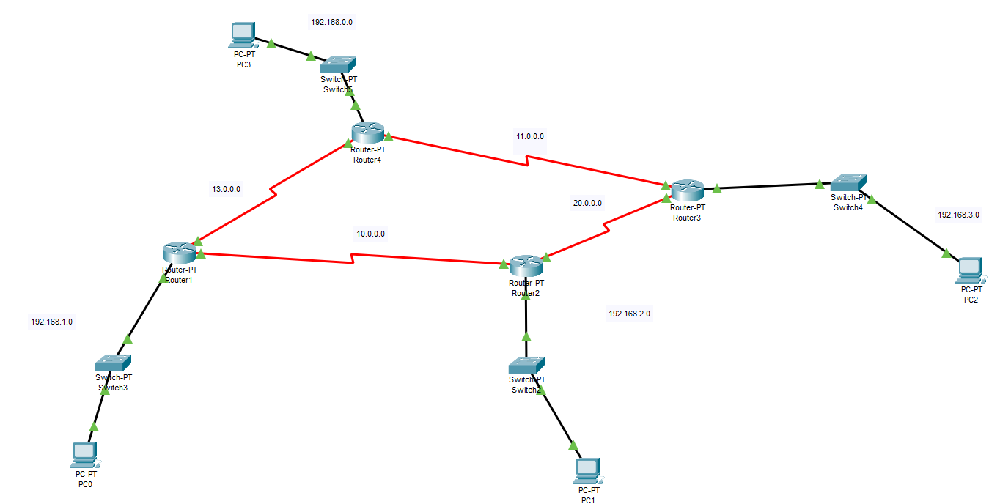

# RIP

This is a rip routing lab in which we will learn how to configure RIP routing for a network.  

## Part 1

### Step 1

You are to configure a network with 2 user end devices and three **Router 1841** as seen in figure  

Figure 1 illustrates how the setup should look. 


<div align=center>


**Figure 1 RIP Setup**

</div>

~~~admonish tip 

Remember to use the `?`  if you are unsure on what to do next or how each command, argument, keyword works

If you are struggling to get the components you can download the pkt file here: [rip_1.pkt](./rip_1.pkt)
~~~

### Step 2

For each **Router 1841** you will need to single click to open the configuration window, select the **Physical tab** then click ‘n’ drag **WIC-2T** to the SLOT 0 as seen below. Notice that the **power switch is off**, no green light. 

<div align=center>


</div>

### Step 3

The interfaces should be configured as seen in table 1

<div align=center>



</div>

### Step 4

Next test that your packets can reach from **PC0** to **Router 0** and **PC1** to **Router 2** 

### Step 5

Next check that all **three routers** can receive packages to and from each other, if not revisit your connections and the interface table, table 1. 

### Step 6

Now we are ready to create the **RIP Routing Table** for this network. Click each **router** and go to **Config** and then click **RIP** in the submenu.

<div align=center>


</div>

### Step 7

Next input the following IP’s into **each** Routers RIP Table,

<div align=center>


</div>

### Step 8

Now with click **PC 0** and go to **Desktop** and choose **Command Prompt**

<div align=center>



</div>

### Step 9

Then **ping** PC 1’s IP and you should have a successful return 

<div align=center>


</div>

### Step 10

Then let us see which IP route the packets took, use the tracert command

<div align=center>


</div>

### Step 11

Repeat for the other PC.

### Step 12

Now what happens when one of the routes is taking down, hypothetically the wire has a fault. Turn off the ports s/0/0/1 for router 0 and router 2 and you should see two red triangles.


<div align=center>


</div>

### Step 13

Before redoing steps 9 10 and 11, what do you think will happen, what outputs might you see on the command prompt for ping and tracert. 

### Step 14

After completing steps 9,10 and 11, do the outputs confirm what you thought in step 13? If not why, and if so why?

### Step 15

In each router add a password for each mode using the password command as seen in the lecture.

### Step 16

For each router add the following banner motd

This device is for authorized personnel only. If you have not been provided with permission to access this device - disconnect at once.

### Step 17

Now create a `#banner login # message`

~~~admonish terminal

```
*** Login Required. Unauthorized use is prohibited **
```

~~~

### Step 18

Additionally, an `EXEC` message too `#banner exec #`

~~~admonish terminal

```
*** Ensure that you update the system configuration ***
*** documentation after making system changes.      ***
```

~~~

### Step 19

Finally test that all routers are password protected and that the messages for 16 to 18 are present.

## Part 2

### Step 1

You are to configure a network with 4 user end devices and three **Router 1841** as seen in figure  


<div align=center>




</div>

~~~admonish tip 

Remember to use the `?`  if you are unsure on what to do next or how each command, argument, keyword works

If you are struggling to get the components you can download the pkt file here: [rip_2.pkt](./rip_2.pkt)
~~~

## Step 2

Refer to Part 1, and try to configure the network.