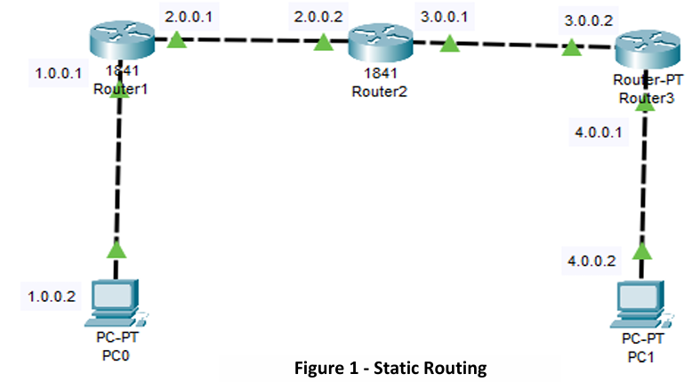

# Static Routing

This is a static routing lab in which we will learn how to configure static routing for a network having three routers inside Cisco Packet Tracer.


Here in this Lab there are three 1841 Routers and a total of four network:

1. 1.0.0.0/8

2. 2.0.0.0/8

3. 3.0.0.0/8 

4. 4.0.0.0/8

Figure 1 illustrates how the setup should look. 

<div align=center>



**Figure 1 - Static Routing**

</div>

~~~admonish tip 

Remember to use the `?`  if you are unsure on what to do next or how each command, argument, keyword works

If you are struggling to get the components you can download the pkt file here: [Static_Routing_1.pkt](./Static_Routing_1.pkt)
~~~


## Step:1 - Configuration on Router R1

Assign an IP address on interfaces of router R1.

~~~admonish terminal

```
Router>enable 
Router# config terminal 
Enter configuration commands, one per line. End with CNTL/Z. 
Router(config)# int fa0/0 
Router(config-if)# ip address 1.0.0.1 255.0.0.0 
Router(config-if)# no shut 
Router(config-if)# exit 
Router(config)# int fa0/1 
Router(config-if)# ip address 2.0.0.1 255.0.0.0 
Router(config-if)# no shut 
```

~~~

## Step:2 - Configure Static Routing on Router R1

~~~admonish terminal

```
Router>exit 
Router#config terminal 
Enter configuration commands, one per line. End with CNTL/Z. 
Router(config)#ip route 3.0.0.0 255.0.0.0 2.0.0.2 
Router(config)#ip route 4.0.0.0 255.0.0.0 2.0.0.2 
```

~~~

## Step:3 - Configuration on Router R2

~~~admonish terminal

```
Router>exit 
Router#config terminal 
Enter configuration commands, one per line. End with CNTL/Z. 
Router(config)#int fa0/0 
Router(config-if)#ip address 2.0.0.2 255.0.0.0 
Router(config-if)#no shut 
Router(config-if)#exit 
Router(config)#int fa0/1 
Router(config-if)#ip address 3.0.0.1 255.0.0.0 
Router(config-if)#no shut
```

~~~

## Step:4 - Configure Static Routing on Router R2

~~~admonish terminal

```
Router>enable 
Router#config terminal 
Enter configuration commands, one per line. End with CNTL/Z. 
Router(config)#ip route 1.0.0.0  255.0.0.0   2.0.0.1 
Router(config)#ip route 4.0.0.0  255.0.0.0   3.0.0.2
```

~~~

## Step:5 - Configuration on Router R3

~~~admonish terminal

```
Router>enable 
Router#config terminal 
Enter configuration commands, one per line. End with CNTL/Z. 
Router(config)#int fa0/1 
Router(config-if)#ip address 3.0.0.2 255.0.0.0 
Router(config-if)#no shut 
Router(config-if)#exit 
Router(config)#int fa0/0  
Router(config-if)#ip address 4.0.0.1 255.0.0.0 
Router(config-if)#no shut
```

~~~

## Step:6 - Configure Static Routing on Router R3

~~~admonish terminal

```
Router>exit 
Router#config terminal 
Enter configuration commands, one per line. End with CNTL/Z. 
Router(config)#ip route  2.0.0.0 255.0.0.0 3.0.0.1 
Router(config)#ip route 1.0.0.0 255.0.0.0 3.0.0.1 
```

~~~


## Step:7 - `ping` and `tracert` `PC0` to `PC1`

Replace `#.#.#.#.` with the appropirate IP addresses

~~~admonish terminal

```
PC#>ping #.#.#.# 
PC#>tracert #.#.#.# 
```

~~~

## Step:8 – Expand Network

- Add another PC off of Router 2 in the Figure 1 and put it on network 5.0.0.0 

- Make it so that only PC on 4.0.0.2 can communication with the new PC on 5.0.0.0, remember this will be two way communication.  There should be no route to 1.0.0.# through 2.0.0.#. 

~~~admonish tip

If you are struggling to get the components you can download the pkt file here: [Static_Routing_2.pkt](./Static_Routing_2.pkt)

~~~

## Step:9 – Expand Network Again

Add another Router and PC with a network of 6.0.0.0 off Router 3 and make it so that this new Router 4 allows communication between 1.0.0.# and 6.0.0.# only. No other PC can communicate to 6.0.0.0. 

~~~admonish question title='Is this possible?'
~~~