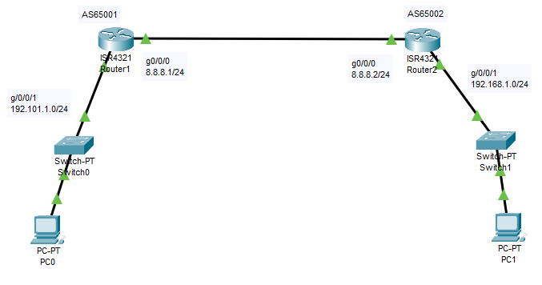

# Border Gateway Protocol

This is a Border Gateway Protocol routing lab in which we will learn how to configure BGP routing for a network having two routers inside packet tracer.  

## BGP Part 1

Here in this Lab there are two Routers and a total of two network: 

1. 192.101.1.0/24 

2. 8.8.8.0/24 

3. 192.168.1.0/24 

Figure 1 illustrates how the setup should look. 


<div align=center>



**Figure 1 BGP Setup**

</div>

~~~admonish tip 

Remember to use the `?`  if you are unsure on what to do next or how each command, argument, keyword works

If you are struggling to get the components you can download the pkt file here: [BGP_Routing_PT1.pkt](./BGP_Routing_PT1.pkt)
~~~


### Step:1 - Configuration on Router R1

Assign an IP address on interfaces of router R1.

~~~admonish terminal

```
Router>en 

Router# show ip inter br 

Router# show ip protocols 

Router# show ip bgp 

Router# config t 

Router(config)# int gig0/0/0 

Router(config-if)# ip address 192.101.1.1 255.255.255.0 

Router(config-if)# no shut 

Router(config-if)# exit 

Router(config)# int gig0/0/1 

Router(config-if)# ip address 8.8.8.1 255.255.255.0 

Router(config-if)# no shut 

Router(config-if)# end 

Router# show ip inter br 
```

~~~

### Step:2 - Configure BGP for Router 1 

~~~admonish terminal

```
Router# config t 

Router(config)# router ? 

Router(config)# router bgp ? 

Router(config)# router bgp 65001 

Router(config-router)# neighbor ? 

Router(config-router)# neighbor 8.8.8.2 ? 

Router(config-router)# neighbor 8.8.8.2 remote-as 65002 

Router(config-router)# ? 

Router(config-router)# network 192.101.1.0 mask 255.255.255.0 

Router(config-router)# end 

Router# wr ? 

Router# wr memory 

Router# show ip bgp  

    BGP table version is 1, local router ID is 192.168.1.1 

Router# show ip bgp summary 

    BGP router identifier 192.168.1.1, local AS number 65001 

    Neighbor        V    AS       MsgRcvd    MsgSent   TblVer  InQ   OutQ    Up/Down  State/PfxRcd 

    8.8.8.2             4  65002       0                   0                1         0       0          00:45:46         4 

```

~~~

### Step:3 - Configuration on Router R2

~~~admonish terminal

```
Router>en 

Router# show ip inter br 

Router# show ip protocols 

Router# show ip bgp 

Router# config t 

Router(config)# int gig0/0/0 

Router(config-if)# ip address 192.168.1.1 255.255.255.0 

Router(config-if)# no shut 

Router(config-if)# exit 

Router(config)# int gig0/0/1 

Router(config-if)# ip address 8.8.8.2 255.255.255.0 

Router(config-if)# no shut 

Router(config-if)# end 

Router# show ip inter br 
```

~~~

### Step:4 - Configure Static Routing on Router R2

~~~admonish terminal

```
Router# config t 

Router(config)# router ? 

Router(config)# router bgp ? 

Router(config)# router bgp 65002 

Router(config-router)# neighbor ? 

Router(config-router)# neighbor 8.8.8.1 ? 

Router(config-router)# neighbor 8.8.8.1 remote-as 65001 

```

~~~

~~~admonish output

```
Router(config-router)#%BGP-5-ADJCHANGE: neighbor 8.1.1.1 Up 
```

~~~

~~~admonish terminal

```
Router(config-router)# ? 

Router(config-router)# network 192.168.1.0 mask 255.255.255.0 

Router(config-router)# end 

Router# wr ? 

Router# wr memory

Router# show ip bgp  

    BGP table version is 1, local router ID is 192.168.1.1 

Router# show ip bgp summary 

    BGP router identifier 192.101.1.1, local AS number 65001 

    Neighbor        V    AS       MsgRcvd    MsgSent   TblVer  InQ   OutQ    Up/Down  State/PfxRcd 

    8.8.8.2             4  65002       0                   0                1         0       0          00:45:46         4 

Router# wr memory

Router#ping 8.8.8.1 

    Type escape sequence to abort. 

    Sending 5, 100-byte ICMP Echos to 8.8.8.1, timeout is 2 seconds: 

    !!!!! 

    Success rate is 100 percent (5/5), round-trip min/avg/max = 0/0/1 ms 

Router#tracer 192.101.1.2 

    Type escape sequence to abort. 

    Tracing the route to 192.101.1.2 

    1   8.8.8.2         0 msec    0 msec    0 msec     

    2   192.168.1.2     0 msec    0 msec    0 msec     
```

~~~


## BGP Part 2

Here in this Lab there are two Routers and a total of two network: 

1. 192.101.1.0/24 

2. 8.8.8.0/24 

3. 10.2.3.0/24  

4. 192.168.1.0/24

Figure 2 illustrates how the setup should look. 


<div align=center>


**Figure 2 BGP Setup**

</div>

~~~admonish tip 

Remember to use the `?`  if you are unsure on what to do next or how each command, argument, keyword works

If you are struggling to get the components you can download the pkt file here: [BGP_Routing_PT2.pkt](./BGP_Routing_PT2.pkt)
~~~

### Step:1 - Configuration on Router R1

Assign an IP address on interfaces of router R1.

~~~admonish terminal

```
Router>en 

Router# show ip inter br 

Router# show ip protocols 

Router# show ip bgp 

Router# config t 

Router(config)# int gig0/0/0 

Router(config-if)# ip address 192.101.1.1 255.255.255.0 

Router(config-if)# no shut 

Router(config-if)# exit 

Router(config)# int gig0/0/1 

Router(config-if)# ip address 8.8.8.1 255.255.255.0 

Router(config-if)# no shut 

Router(config-if)# end 

Router# show ip inter br 
```

~~~

### Step:2 - Configure BGP for Router 1 

~~~admonish terminal

```
Router# config t 

Router(config)# router ? 

Router(config)# router bgp ? 

Router(config)# router bgp 65001 

Router(config-router)# neighbor ? 

Router(config-router)# neighbor 8.8.8.2 ? 

Router(config-router)# neighbor 8.8.8.2 remote-as 65002 

Router(config-router)# ? 

Router(config-router)# network 192.101.1.0 mask 255.255.255.0 

Router(config-router)# end 

Router# wr ? 

Router# show ip bgp  

    BGP table version is 1, local router ID is 192.168.1.1 

Router# show ip bgp summary 

    BGP router identifier 192.168.1.1, local AS number 65001 

    Neighbor        V    AS       MsgRcvd    MsgSent   TblVer  InQ   OutQ    Up/Down  State/PfxRcd 

    8.8.8.2             4  65002       0                   0                1         0       0          00:45:46         4 

```

~~~

### Step:3 - Configuration on Router R2

~~~admonish terminal

```
Router>en 

Router# show ip inter br 

Router# show ip protocols 

Router# show ip bgp 

Router# config t 

Router(config)# int gig0/0/0 

Router(config-if)# ip address 8.8.8.2 255.255.255.0 

Router(config-if)# no shut 

Router(config-if)# exit 

Router(config)# int gig0/0/1 

Router(config-if)# ip address 10.2.3.1 255.255.255.0 

Router(config-if)# no shut 

Router(config-if)# end 

Router# show ip inter br 
```

~~~

### Step:4 - Configure Static Routing on Router R2

~~~admonish terminal

```
Router# config t 

Router(config)# router ? 

Router(config)# router bgp ? 

Router(config)# router bgp 65002 

Router(config-router)# neighbor ? 

Router(config-router)# neighbor 8.8.8.1 ? 

Router(config-router)# neighbor 8.8.8.1 remote-as 65001

```

~~~

~~~admonish output

```
Router(config-router)#%BGP-5-ADJCHANGE: neighbor 8.1.1.1 Up 
```

~~~

~~~admonish terminal 

```
Router(config-router)# neighbor 10.2.3.2 remote-as 65003 

Router(config-router)# end 

Router# wr ? 

Router# wr memory

Router# show ip bgp  

    BGP table version is 1, local router ID is 192.168.1.1 

Router# show ip bgp summary 

    BGP table version is 3, local router ID is 10.2.3.1 

    Network                    Next Hop       Metric    LocPrf      Weight           Path 

    * 8.8.8.0/24               8.8.8.1              0             0                 0 		65001 i 

    *> 192.101.1.0/24    8.8.8.1              0             0                 0 		65001 i 

Router# wr ?

Router# wr memory

Router#ping 8.8.8.1 

    Type escape sequence to abort. 

    Sending 5, 100-byte ICMP Echos to 8.8.8.1, timeout is 2 seconds: 

    !!!!! 

    Success rate is 100 percent (5/5), round-trip min/avg/max = 0/0/1 ms 

Router#tracer 192.101.1.2 

    Type escape sequence to abort. 

    Tracing the route to 192.101.1.2 

    1   8.8.8.2         0 msec    0 msec    0 msec     

    2   192.168.1.2     0 msec    0 msec    0 msec       
```

~~~

### Step:5 - Configuration on Router R3 


~~~admonish terminal

```
Router>en 

Router# show ip inter br 

Router# show ip protocols 

Router# show ip bgp 

Router# config t 

Router(config)# int gig0/0/0 

Router(config-if)# ip address 10.2.3.2 255.255.255.0 

Router(config-if)# no shut 

Router(config-if)# exit 

Router(config)# int gig0/0/1 

Router(config-if)# ip address 192.168.1.1 255.255.255.0 

Router(config-if)# no shut 

Router(config-if)# end 

Router# show ip inter br 
```

~~~

### Step:5 - Configure BGP for Router R3 


~~~admonish terminal

```
Router# config t 

Router(config)# router ? 

Router(config)# router bgp ? 

Router(config)# router bgp 65003 

Router(config-router)# neighbor ? 

Router(config-router)# neighbor 10.2.3.1 ? 

Router(config-router)# neighbor 10.2.3.1 remote-as 65002 

```

~~~

~~~admonish output

```
Router(config-router)#%BGP-5-ADJCHANGE: neighbor 10.2.3.1 Up 
```
~~~

~~~admonish terminal

```
Router(config-router)# network 192.168.1.0 mask 255.255.255.0 

Router(config-router)# end 

Router# wr ?

Router# wr memory
```

~~~

### Step:6 - Ping

Use `tracert` on pc1 and pc2 to see if your route is setup correctly, you may need to ping a few times to make the route tables upate. 